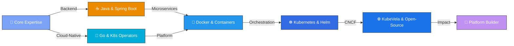

##  &nbsp;About Me

<div align="center">

<!-- 📌 Place about-me-card.svg in your profile repo root -->


</div>

<br/>

---

## 🛠️ &nbsp;Tech Stack & Tools

<div align="center">

| Category | Technologies |
|:---------|:-------------|
| **Languages** | <a href="https://skillicons.dev"></a> |
| **Cloud Native & Infra** | <a href="https://skillicons.dev"></a> |
| **Frameworks & Backend** | <a href="https://skillicons.dev"></a> |
| **DevOps & CI/CD** | <a href="https://skillicons.dev"></a> |
| **Dev Environment** | <a href="https://skillicons.dev"></a> |
| **AI & Agent Tools** |     |

</div>

---

## 🧰 &nbsp;Tools & Platforms I Work With

<div align="center">

| Category | Tools |
|:---------|:------|
| **IDEs & Editors** |     |
| **Containers & Orchestration** |      |
| **CI/CD & DevOps** |     |
| **Version Control** |    |
| **Monitoring & Observability** |    |
| **Databases** |    |
| **OS & Terminal** |     |
| **API & Testing** |    |
| **Collaboration** |     |

</div>

---

## 📊 &nbsp;GitHub Analytics

<div align="center">

<!-- 🔧 If stats break, deploy your own: https://github.com/anuraghazra/github-readme-stats#deploy-on-your-own-vercel-instance
     Mirror 1: github-readme-stats-git-masterrstaa-rickstaa.vercel.app
     Mirror 2: github-readme-stats.vercel.app
     Mirror 3: github-readme-stats-sigma-five.vercel.app -->

&nbsp;&nbsp;


<br/><br/>

[](https://git.io/streak-stats)

</div>

---

## 🏆 &nbsp;GitHub Trophies

<div align="center">

<!-- If trophies break, try these mirrors (swap the URL domain):
     https://github-profile-trophy-liard-delta.vercel.app
     https://github-profile-trophy-fork-two.vercel.app
     https://github-profile-trophy-winning.vercel.app
     https://github-profile-trophy-kannan.vercel.app
     Or best: deploy your own → https://github.com/ryo-ma/github-profile-trophy -->


</div>

---

## 📈 &nbsp;Contribution Graph

<div align="center">


</div>

---

## 🚀 &nbsp;Open-Source Contributions — KubeVela

<div align="center">

> *Active contributor to [KubeVela](https://kubevela.io) (7.6k+ ⭐) — a CNCF project for modern application delivery on Kubernetes*

</div>

<table>
<tr>
<td width="50%">

### 🌟 Key Contributions

| Area | Description |
|------|-------------|
| **CUE Validation** | Fail-fast validation for required parameters including dynamic sources |
| **Dev Logging** | Colorized logging support with `--dev-logs` for enhanced local DX |
| **Webhook Security** | Fixed TLS caBundle breakage during failed Helm upgrades |
| **K8s Upgrades** | Upgraded Kubernetes dependencies to v0.31.10 with CLI enhancements |
| **Component Defs** | Modified webservice component definitions for resource requirements |
| **Docker Deps** | Updated Docker dependencies from v25.0.6 to v28.3+ |

</td>
<td width="50%">

### 📊 Contribution Areas

```text
🎯 Core Controller Logic    ██████████░░  80%
🔧 Webhook & Validation     ████████░░░░  65%
📦 Dependency Management     ███████░░░░░  55%
🧪 Testing & CI/CD          ██████░░░░░░  50%
📝 Documentation & Helm     █████░░░░░░░  40%
🌐 Multicluster Support     ████░░░░░░░░  35%
```

</td>
</tr>
</table>

<details>
<summary><b>📌 Notable Pull Requests (Click to expand)</b></summary>
<br>

| PR | Title | Status |
|----|-------|--------|
| [#6931](https://github.com/kubevela/kubevela/pull/6931) | **Feat(logging):** Colorized logging for local dev with `--dev-logs` | ✅ Merged |
| [#6919](https://github.com/kubevela/kubevela/pull/6919) | **Fix:** Webhook TLS caBundle breakage during failed Helm upgrades | ✅ Merged |
| [#6849](https://github.com/kubevela/kubevela/pull/6849) | **Chore:** Update Docker dependencies v25.0.6 → v28.3+ | ✅ Merged |
| [#6837](https://github.com/kubevela/kubevela/pull/6837) | **Chore:** Upgrade K8s deps to v0.31.10 & enhance CLI/workflows | ✅ Merged |
| [#6774](https://github.com/kubevela/kubevela/pull/6774) | **Feat(validation):** Fail-fast CUE validation for required parameters | ✅ Merged |
| [#6714](https://github.com/kubevela/kubevela/pull/6714) | **Fix:** Webservice component definition resource requirements | ✅ Merged |

</details>

---

## 🗺️ &nbsp;My Journey



---

<div align="center">

###  &nbsp;Let's Connect!

*I'm always excited to discuss cloud-native technologies, Kubernetes, open-source contributions, or even swap travel stories!*

<br/>

<a href="https://www.linkedin.com/in/vishal210893" target="_blank">

</a>&nbsp;&nbsp;
<a href="mailto:vishal210893@gmail.com" target="_blank">

</a>&nbsp;&nbsp;
<a href="https://www.instagram.com/vishal_21kr" target="_blank">

</a>&nbsp;&nbsp;
<a href="https://vishalkumar.bio" target="_blank">

</a>

<br/><br/>


<br/><br/>


</div>

<div align="center">


</div>
